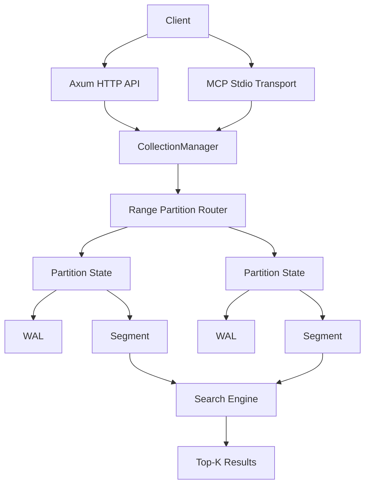

# Architecture Diagram

The following diagram describes the current process architecture.

```mermaid
flowchart TB
    Client[Client] --> HTTP[Axum HTTP API]
    Client --> MCP[MCP Stdio Transport]

    HTTP --> Manager[CollectionManager]
    MCP --> Manager

    Manager --> Route[Range Partition Router]
    Route --> P0[Partition State]
    Route --> P1[Partition State]

    P0 --> WAL0[WAL]
    P0 --> Segment0[Segment]
    P1 --> WAL1[WAL]
    P1 --> Segment1[Segment]

    Segment0 --> Search[Search Engine]
    Segment1 --> Search
    Search --> Results[Top-K Results]
```
