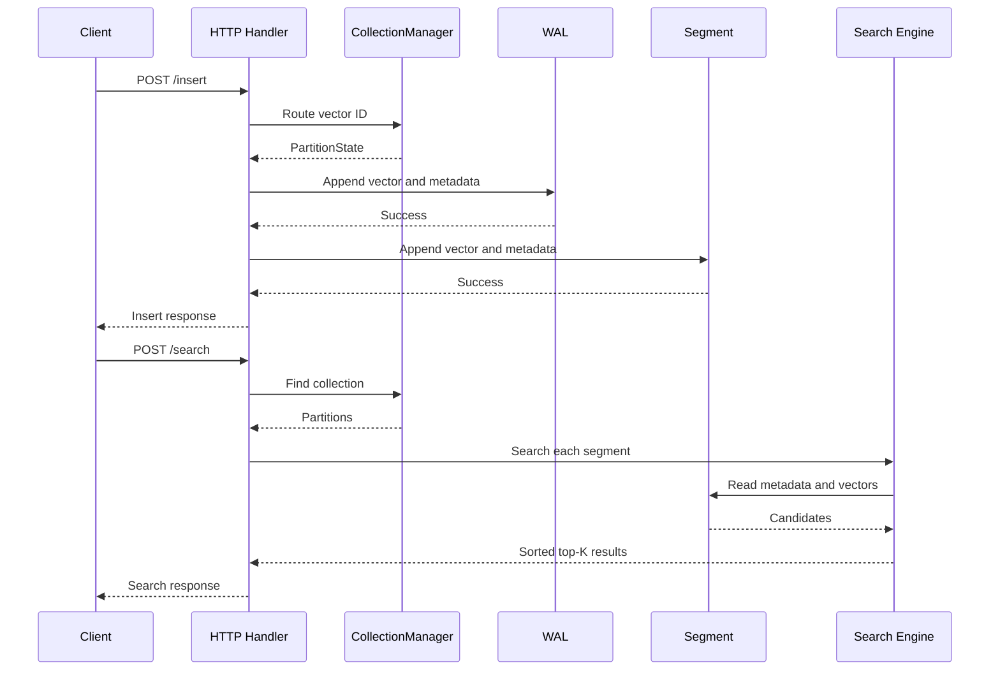

# Data Flow Diagram

## Insert and search data flow

```mermaid
sequenceDiagram
    participant C as Client
    participant H as HTTP Handler
    participant M as CollectionManager
    participant W as WAL
    participant S as Segment
    participant Q as Search Engine

    C->>H: POST /insert
    H->>M: Route vector ID
    M-->>H: PartitionState
    H->>W: Append vector and metadata
    W-->>H: Success
    H->>S: Append vector and metadata
    S-->>H: Success
    H-->>C: Insert response

    C->>H: POST /search
    H->>M: Find collection
    M-->>H: Partitions
    H->>Q: Search each segment
    Q->>S: Read metadata and vectors
    S-->>Q: Candidates
    Q-->>H: Sorted top-K results
    H-->>C: Search response
```
