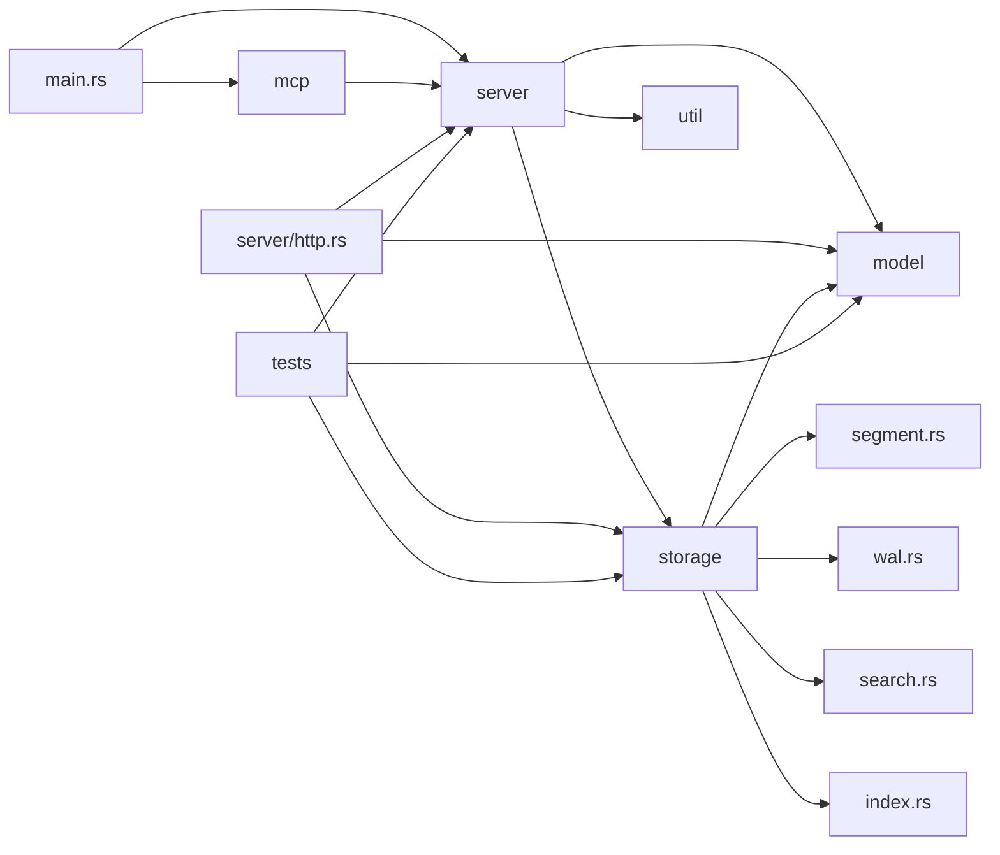

# Module Dependency Diagram

```mermaid
flowchart LR
    Main[main.rs] --> Server[server]
    Main --> MCP[mcp]
    Server --> Model[model]
    Server --> Storage[storage]
    Server --> Util[util]
    MCP --> Server
    HTTP[server/http.rs] --> Server
    HTTP --> Storage
    HTTP --> Model
    Storage --> Model
    Storage --> Segment[segment.rs]
    Storage --> WAL[wal.rs]
    Storage --> Search[search.rs]
    Storage --> Index[index.rs]
    Tests[tests] --> Model
    Tests --> Server
    Tests --> Storage
```
